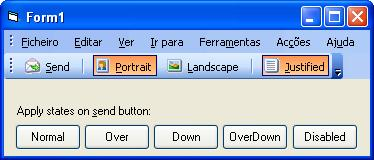



## Office 2003 Button

### Description

This code improve Office 2003 Button for VB. With MouseOver effect (No Flicker), CheckButton, ToolTipText, Frozen (Enabled Property). You can built a nice Toolbar. I Just improve and join same other code peaces from PSC. THANKS PSC
 
### More Info
 

             |
---                |---
**Submitted On**   |2005-01-19 10:57:56
**By**             |[Joao Carlos Fortes](https://github.com/Planet-Source-Code/PSCIndex/blob/master/ByAuthor/joao-carlos-fortes.md)
**Level**          |Intermediate
**User Rating**    |5.0 (35 globes from 7 users)
**Compatibility**  |VB 6\.0
**Category**       |[Custom Controls/ Forms/  Menus](https://github.com/Planet-Source-Code/PSCIndex/blob/master/ByCategory/custom-controls-forms-menus__1-4.md)
**World**          |[Visual Basic](https://github.com/Planet-Source-Code/PSCIndex/blob/master/ByWorld/visual-basic.md)
**Archive File**   |[Office\_2001841771192005\.zip](https://github.com/Planet-Source-Code/joao-carlos-fortes-office-2003-button__1-58361/archive/master.zip)

